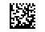

# QR CODE (58)

## Barcode with "hash ID"
```
zint -o QR.png --height=48 -w 4 --border=2  -b 58 -d 1234567890123456789
```
* 66x50 pixels </br >


## Add text (issue number) up to 8 chars.

```
convert QR.png -gravity South -background white -splice 0x16 -annotate +0+2 '12345678' QR_ID.png
```
* 66x66 pixels </br>


# Data Matrix (71)

## Barcode with "hash ID"

```
zint -o DM.png --square --height=48 -w 4 --border=2  -b 71 -d 1234567890123456789
```

* 56x40 pixels </br >



## Add text (issue number) up to 7 chars

```
convert DM.png  -gravity South -background white -splice 0x16 -annotate +0+2 '1234567' DM_ID.png
```
* 56x56 pixels </br >

