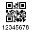

# QR CODE

* Barcode with "hash ID"
```
zint --height=48 -w 4 --border=2  -b 58 -d 1234567890123456789 -o QR.png
```
66x50 pixels


* Add text (issue number) up to 8 chars.

```
convert QR.png \
	-gravity South -background white -splice 0x16 -annotate +0+2 '12345678' \
	QR_ID.png
```
66x66 pixels



